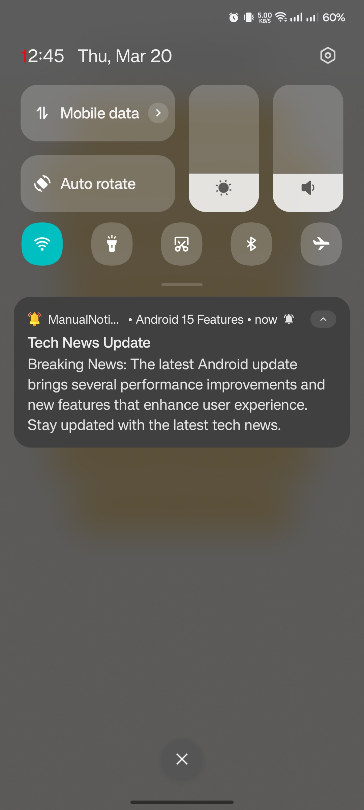
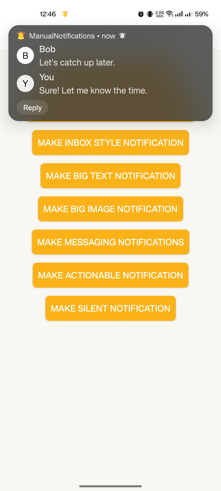

# ManualNotifications

This repository demonstrates different types of Android notifications using a simple activity with 8 buttons. Clicking each button triggers a corresponding notification.

## Notification Types

1. Normal Notification

2. Notification with Heads-Up Display

3. Inbox Style Notification

4. Big Text Notification

5. Big Image Notification

6. Messaging Notification

7. Actionable Notification

8. Silent Notification


## Screenshots

| Notification Type          | Screenshot |
|---------------------------|------------|
| Normal Notification       |  |
| Heads-Up Notification     |  |
| Inbox Style Notification (Summery)  |  |
| Inbox Style Notification (Extended)  |  |
| Big Text Notification (Summery)    |  |
| Big Text Notification (Extended)    |  |
|Image Notification (Summery)    |  |
|Image Notification (Preview)    |  |
| Messaging Notification    |  |
| Messaging Notification (Replay)   |  |
| Actionable Notification   |  |
| Silent Notification       |  |


## Features
```
- Uses Glide to display images in picture notifications.
- Implements BroadcastReceiver to handle notification actions, such as:
  - Replying to messages.
  - Marking notifications as read.
```

## How to Use
```
1. Clone the repository.
2. Open the project in Android Studio.
3. Run the app on an emulator or physical device.
4. Click on any button to trigger the corresponding notification.
```

## Dependencies
```gradle
dependencies {
    implementation 'com.github.bumptech.glide:glide:4.16.0'
}
```


